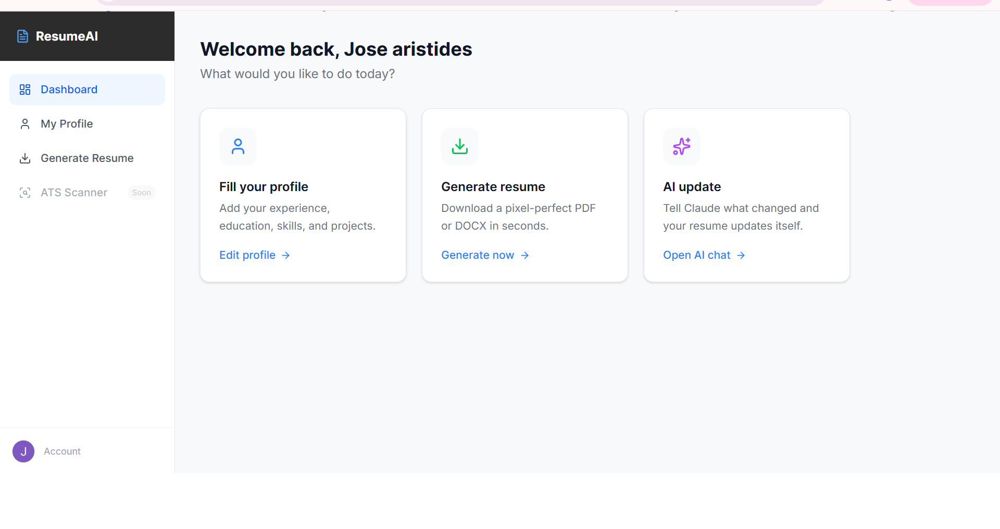

# ResumeAI

AI-powered resume generator — upload your existing CV or fill in your profile, generate a polished PDF or DOCX, and update it with natural language.

**Live demo:** https://resumeai-umber-zeta.vercel.app



---

## Features

- **Upload Resume** — upload any PDF or DOCX and Claude AI parses it into your profile automatically
- **AI Update** — chat with Claude to update your profile ("I got promoted to Senior Engineer", "Add Docker to my skills")
- **LinkedIn Import** — import your LinkedIn data export ZIP
- **Generate PDF / DOCX** — download a professionally formatted resume instantly
- **Profile Editor** — edit every section manually: experience, education, skills, projects, languages, certificates

---

## Tech Stack

| Layer | Tech |
|-------|------|
| Frontend | Next.js 16, TypeScript, Tailwind CSS v4 |
| Auth | Clerk |
| Backend | FastAPI (Python) |
| Database | SQLite (dev) / PostgreSQL (prod) |
| AI | Claude Sonnet 4.6 (Anthropic) |
| PDF generation | Playwright (headless Chromium) |
| DOCX generation | python-docx |
| Resume parsing | pdfplumber + Claude AI |
| Deploy | Vercel (frontend) + Railway (backend) |

---

## Local Development

### Prerequisites
- Node.js 18+
- Python 3.12+
- Playwright Chromium (`playwright install chromium`)

### Backend

```bash
cd backend
pip install -r requirements.txt
playwright install chromium
```

Create `backend/.env`:
```
ANTHROPIC_API_KEY=your_key
CLERK_SECRET_KEY=your_clerk_secret
DATABASE_URL=sqlite:///./resumeai.db
FRONTEND_URL=http://localhost:3000
```

```bash
python -m uvicorn main:app --reload --port 8003
```

### Frontend

Create `frontend/.env.local`:
```
NEXT_PUBLIC_CLERK_PUBLISHABLE_KEY=your_clerk_publishable_key
CLERK_SECRET_KEY=your_clerk_secret
NEXT_PUBLIC_API_URL=http://localhost:8003
NEXT_PUBLIC_CLERK_SIGN_IN_URL=/sign-in
NEXT_PUBLIC_CLERK_SIGN_UP_URL=/sign-up
NEXT_PUBLIC_CLERK_AFTER_SIGN_IN_URL=/dashboard
NEXT_PUBLIC_CLERK_AFTER_SIGN_UP_URL=/dashboard
```

```bash
cd frontend
npm install
npm run dev
```

Open http://localhost:3000

---

## Project Structure

```
resumeai/
├── frontend/          # Next.js app
│   ├── app/
│   │   ├── page.tsx              # Landing page
│   │   ├── sign-in/              # Clerk sign-in
│   │   ├── sign-up/              # Clerk sign-up
│   │   └── dashboard/
│   │       ├── page.tsx          # Dashboard home
│   │       ├── profile/          # Profile editor + AI chat
│   │       └── generate/         # PDF / DOCX download
│   └── lib/api.ts                # API client
└── backend/           # FastAPI app
    ├── main.py                   # All endpoints
    ├── models.py                 # SQLAlchemy models
    ├── generator.py              # PDF + DOCX generation
    ├── resume_parser.py          # PDF/DOCX → profile via Claude
    ├── linkedin.py               # LinkedIn ZIP import
    └── templates/resume.html     # Jinja2 resume template
```

---

## API Endpoints

```
GET  /health                  — health check
GET  /api/profile             — get user profile
PUT  /api/profile             — save user profile
POST /api/resume/upload       — upload PDF/DOCX, parse into profile
POST /api/linkedin/import     — import LinkedIn ZIP
POST /api/generate/pdf        — generate PDF resume
POST /api/generate/docx       — generate DOCX resume
POST /api/ai/update           — update profile via natural language
```

---

## Author

Jose Aristides Cardona — [github.com/josecardona1994](https://github.com/josecardona1994)
